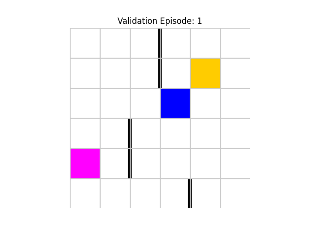

# Taksi Q Learning Report

## Ortam (Environment)

6x6 grid içerisinde 36 hücreden oluşan ortamda, seçili beş noktadan rastgele bir tanesinde bulunmakta olan yolcu, öğrenme ajanı olarak belirlenmiş taksi tarafından alınarak, yine aynı seçili beş nokta içerisinden hedef olarak belirlenmiş hücreye bırakılmalıdır. Grid içerisinde oluşturulmuş bazı duvarlar bir hücreden diğer hücreye geçiş yollarını kısıtladığından taksinin bu duvarları öğrenerek hücreler arası geçişi sağlaması gerekir.

Taksi için bir bölüm, yolcunun başarılı bir şekilde konumuna bırakılmasıyla veya maksimum adım (step) sayısına ulaşılmasıyla son bulur.

## Durum (State)

Sistemdeki bir state, taksinin ve sütun konumları, yolcunun bulunduğu hücre, ve yolcunun bırakılacağı hücreden oluşmaktadır.

Yolcu ve yolcunun gitmesi gerken noktaların seçimi, environment içerisinde belirli beş nokta içerisinden yapılacağından, taksi ve yolcunun konumu bu beş noktadan birinde olacak şekilde kısıtlanır. 

**State Değerleri:**

Mümkün olan toplam state değeri 6x6x(5+1)x5 şeklindedir.

1. Taksi Row → 6 ihtimal
2. Taksi Col → 6 ihtimal
3. Yolcu → 5 ihtimal + 1 taksinin içinde bulunma ihtimali
4. Konum → 5 ihtimal

## Taksinin Hareketleri (Actions)

- SOUTH: Taksinin aşağı yönde hareketi
- NORTH: Taksinin yukarı yönde hareketi
- EAST: Taksinin sağa hareketi
- WEST: Taksinin sola hareketi
- PICK_UP: Yolcunun beklediği konumdan alınması
- DROP_OFF: Yolcunun hedefe bırakılması

## Action Mask:

Taksinin duvarların içerisinden geçmek gibi grid yapısının izin vermediği davranışları engellemek için action mask ile taksi hareketlerine kısıtlar getirilmiştir.

## Ödül Sistemi (Positive/Negative Rewards)

- Ödül -1 default değeri ile başlar.
- Yanlış noktadan yolcu alındığında taksi -10 ödülünü alırken doğru noktadan yolcu alındığında taksi +10 ödülünü alır.
- Yolcu yanlış yerde bırakıldığında ödül -10 olurken doğru noktada yolcu bırakıldığında ödül +20 olur.

## Ortam Simülasyonu

Gerek eğitim sürecindeki bölümlerin gerek test sürecindeki bölümlerin hareketleri, grid içerisinde her bir bileşen farklı renklerle gösterilerek animasyon şeklinde görüntülenebilir. Taksi yolcu olmadığında sarı renklidir. Taksiyi bekleyen yolcu mavi renkle gösterilir. Yolcu taksiye bindiğinde taksi yeşil olur ve sarı renkli hedefe yolcu bırakıldığında bölüm sonlandırılır. 

**Örnek bir test simülasyonu:**

